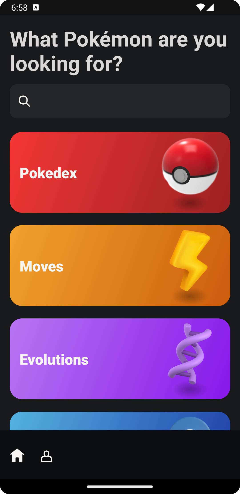
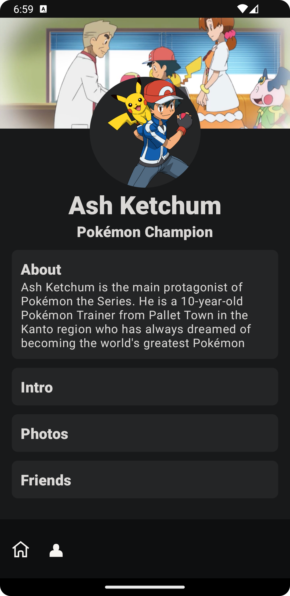

# Pokedex

A sample Treehouse app

### Latest

<div style="display: flex; flex-direction: row; justify-content: space-evenly;">
 

</div>

### Development

#### Serve Zipline

```shell
./gradlew :treehouse:zipline:serveDevelopmentZipline --info --continuous
```

#### Run Android

```shell
./gradlew :android:app:installDebug
```

